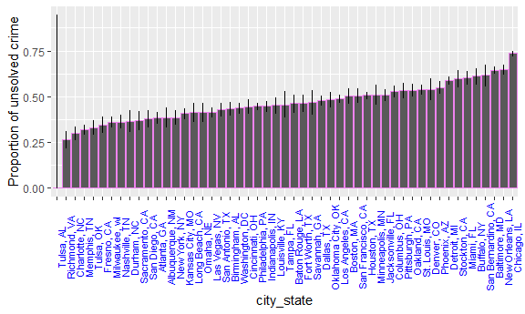

Homework 5
================
Anusorn Thanataveerat
November 1, 2018

true

Problem 1
---------

``` r
file_list = list.files(path = 'data/', pattern = "*.csv")

#function to lead each dataset and create id and group variable
read_add_id_arm <- function(x){
  read_csv(paste('data/', x, sep = '')) %>% 
    mutate(id = str_sub(x, 5, 6), arm = str_sub(x, 1, 3))
}

  map_df(.x = file_list, ~ read_add_id_arm(.x)) %>% 
  gather(key = week, value = value, week_1:week_8) %>% 
  separate(week, into = c('remove', 'week'), sep = '_') %>% 
  select(id, arm, everything(), -remove) %>% 
  mutate(arm = as.factor(arm)) %>% 
  #Spaghetti plot
  ggplot(aes(x = as.numeric(week), y = value, color = arm,
  group = interaction(arm, id))) + 
  geom_line() + xlab('Week') +
  scale_color_discrete(name = "Study Arm",
                       breaks = c("con", "exp"),
                      labels = c("Control", "Experimental"))
```


**Answer**: Whatever value it is they are measuring, those in experimental arm increase over time while people in the control arm didn't see any increase within the 8-week duration under study. Actually some saw a decrease in the outcome

Problem 2
---------

``` r
homicide_dat <-
  read_csv('https://raw.githubusercontent.com/washingtonpost/data-homicides/master/homicide-data.csv') %>% 
  mutate(reported_date = ymd(reported_date), 
         city_state = paste(city, state, sep = ', '))
```

    ## Warning: 2 failed to parse.

``` r
#Create tidy dataframe  
homicide_df <-  homicide_dat %>% 
    mutate(case_open = ifelse(disposition != 'Closed by arrest', 1, 0)) %>% 
    add_count(city_state) %>% 
    group_by(city_state) %>% 
    mutate(unsolved_case = sum(case_open)) %>% 
    filter(case_open == 1 | 
          n == 1) %>% #to account for location with no open case  
    select(city_state, unsolved_case, total = n, ) %>% 
    distinct() %>% 
    mutate(percent_unsolved = round(unsolved_case*100/total),1) %>% 
    select(-`1`)
```

The raw data contains 52179 homicide cases from 2007-01-01 to the end of 2017 (2017-12-31). It is collected from 51 cities in 28 states. According to this data, Chicago, IL has the highest homicide cases (5535). 63.9% of the victims are Black and 78.1% are male. Here is the table showing the total number of homicides and number of unsolved homidicdes by city.

``` r
    homicide_df %>% kable()
```

| city\_state        |  unsolved\_case|  total|  percent\_unsolved|
|:-------------------|---------------:|------:|------------------:|
| Albuquerque, NM    |             146|    378|                 39|
| Atlanta, GA        |             373|    973|                 38|
| Baltimore, MD      |            1825|   2827|                 65|
| Baton Rouge, LA    |             196|    424|                 46|
| Birmingham, AL     |             347|    800|                 43|
| Boston, MA         |             310|    614|                 50|
| Buffalo, NY        |             319|    521|                 61|
| Charlotte, NC      |             206|    687|                 30|
| Chicago, IL        |            4073|   5535|                 74|
| Cincinnati, OH     |             309|    694|                 45|
| Columbus, OH       |             575|   1084|                 53|
| Dallas, TX         |             754|   1567|                 48|
| Denver, CO         |             169|    312|                 54|
| Detroit, MI        |            1482|   2519|                 59|
| Durham, NC         |             101|    276|                 37|
| Fort Worth, TX     |             255|    549|                 46|
| Fresno, CA         |             169|    487|                 35|
| Houston, TX        |            1493|   2942|                 51|
| Indianapolis, IN   |             594|   1322|                 45|
| Jacksonville, FL   |             597|   1168|                 51|
| Kansas City, MO    |             486|   1190|                 41|
| Las Vegas, NV      |             572|   1381|                 41|
| Long Beach, CA     |             156|    378|                 41|
| Los Angeles, CA    |            1106|   2257|                 49|
| Louisville, KY     |             261|    576|                 45|
| Memphis, TN        |             483|   1514|                 32|
| Miami, FL          |             450|    744|                 60|
| Milwaukee, wI      |             403|   1115|                 36|
| Minneapolis, MN    |             187|    366|                 51|
| Nashville, TN      |             278|    767|                 36|
| New Orleans, LA    |             930|   1434|                 65|
| New York, NY       |             243|    627|                 39|
| Oakland, CA        |             508|    947|                 54|
| Oklahoma City, OK  |             326|    672|                 49|
| Omaha, NE          |             169|    409|                 41|
| Philadelphia, PA   |            1360|   3037|                 45|
| Phoenix, AZ        |             504|    914|                 55|
| Pittsburgh, PA     |             337|    631|                 53|
| Richmond, VA       |             113|    429|                 26|
| San Antonio, TX    |             357|    833|                 43|
| Sacramento, CA     |             139|    376|                 37|
| Savannah, GA       |             115|    246|                 47|
| San Bernardino, CA |             170|    275|                 62|
| San Diego, CA      |             175|    461|                 38|
| San Francisco, CA  |             336|    663|                 51|
| St. Louis, MO      |             905|   1677|                 54|
| Stockton, CA       |             266|    444|                 60|
| Tampa, FL          |              95|    208|                 46|
| Tulsa, OK          |             193|    583|                 33|
| Tulsa, AL          |               0|      1|                  0|
| Washington, DC     |             589|   1345|                 44|

``` r
baltimore <- homicide_df %>% 
  ungroup() %>% 
  filter(city_state == 'Baltimore, MD') %>% 
  select(unsolved_case, total)

#Assign function to tidy data after performing the test,
#And only retain the estimate and CIs
prop.test.tidy <- function(x, y){
  prop.test(x, y) %>% tidy() %>% select(estimate, conf.low, conf.high)
}
result_baltimore <- prop.test.tidy(baltimore$unsolved_case, baltimore$total)
```

Focusing on Baltimore, MD, the proportion of homicides that are unsolved is 0.65 (0.63, 0.66).

``` r
finaldat <- map2(homicide_df$unsolved_case, homicide_df$total, prop.test.tidy) %>% bind_rows() %>% bind_cols(., homicide_df) %>% select(city_state, everything()) 
```

    ## Warning in prop.test(x, y): Chi-squared approximation may be incorrect

Create a plot that shows the estimates and CIs for each city – check out geom\_errorbar for a way to add error bars based on the upper and lower limits. Organize cities according to the proportion of unsolved homicides.

``` r
finaldat %>% 
  mutate(city_state = fct_reorder(city_state, estimate)) %>% 
  ggplot(aes(x = city_state, y = estimate)) +
  geom_bar(stat = 'identity', color = 'violet',
           position = position_dodge()) +
  geom_errorbar(aes( ymin = conf.low, ymax = conf.high), width = .1,
                position = position_dodge(0.9)) +
  ylab('Proportion of unsolved crime') +
  theme(axis.text.x = element_text(color = "blue", size = 8, angle = 90)) 
```


