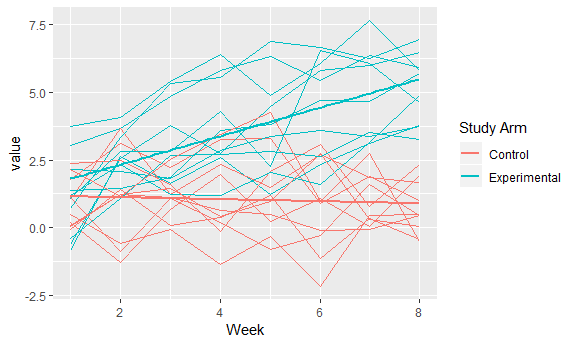

Homework 5
================
Anusorn Thanataveerat
November 1, 2018

true

Problem 1
---------

``` r
file_list = list.files(path = 'data/', pattern = "*.csv")

#function to lead each dataset and create id and group variable
read_add_id_arm <- function(x){
  read_csv(paste('data/', x, sep = '')) %>% 
    mutate(id = str_sub(x, 5, 6), arm = str_sub(x, 1, 3))
}

  map_df(.x = file_list, ~ read_add_id_arm(.x)) %>% 
  gather(key = week, value = value, week_1:week_8) %>% 
  separate(week, into = c('remove', 'week'), sep = '_') %>% 
  select(id, arm, everything(), -remove) %>% 
  mutate(arm = as.factor(arm)) %>% 
  #Spaghetti plot
  ggplot(aes(x = as.numeric(week), y = value, color = arm,
  group = interaction(arm, id))) + 
  geom_line() + xlab('Week') +
  scale_color_discrete(name = "Study Arm",
                       breaks = c("con", "exp"),
                      labels = c("Control", "Experimental"))
```



**Answer**: Whatever value it is they are measuring, those in experimental arm are increasing over time while people in the control arm didn't see any increase within the 8-week duration under study.

Problem 2
---------

``` r
homicide_dat <-
  read_csv('https://raw.githubusercontent.com/washingtonpost/data-homicides/master/homicide-data.csv') %>% 
  mutate(reported_date = ymd(reported_date), 
         city_state = paste(city, state, sep = ', '))
```

    ## Parsed with column specification:
    ## cols(
    ##   uid = col_character(),
    ##   reported_date = col_integer(),
    ##   victim_last = col_character(),
    ##   victim_first = col_character(),
    ##   victim_race = col_character(),
    ##   victim_age = col_character(),
    ##   victim_sex = col_character(),
    ##   city = col_character(),
    ##   state = col_character(),
    ##   lat = col_double(),
    ##   lon = col_double(),
    ##   disposition = col_character()
    ## )

    ## Warning: 2 failed to parse.

Describe the raw data. The raw data contains 52,179 homicide cases from 2,007-01-01 to the end of 2017 (2,017-12-31). It is collected from 51 cities in 28 states. According to this data, Chicago, IL has the highest homicide cases 5,535 % of victims are hispanicxx, x% male, age ranges from x - x
Create a city\_state variable (e.g. “Baltimore, MD”) and then summarize within cities to obtain the total number of homicides and the number of unsolved homicides (those for which the disposition is “Closed without arrest” or “Open/No arrest”).
